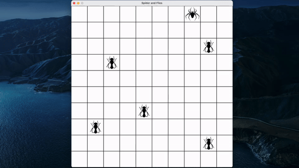
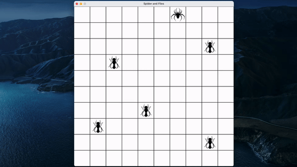
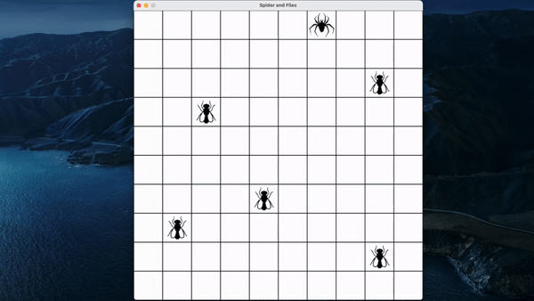

# Reinforcement Learning ASU CSE 691 HW4

This project focuses on simulating the movements of spiders on a board containing flies, using various reinforcement learning techniques. Three scenarios are simulated, each with different strategies for spider movement.

### Base Heuristic

In this scenario, spiders move towards the nearest fly based on the Manhattan distance between them. Describe the implementation of this heuristic and its limitations.

### Single-Agent Rollout

Spiders are moved simultaneously at each step with a 1-step lookahead rollout. Explain how this strategy differs from the base heuristic and its potential advantages.

### Multi-Agent Rollout

Spiders are moved alternatively with a 1-step lookahead rollout. Discuss the rationale behind this approach and its implications compared to the single-agent rollout.

## Simulations

Simulations for each scenario:

### Base Heuristic

### Single-Agent Rollout

### Multi-Agent Rollout

## Usage
1) Clone the repository.
2) `source ./bin/activate` to activate the `venv` envrionment.
2) `pip install -r requirements.txt` for installing libraries.
3) Run each of the 3 `.py` files to run the simulation (Ex: `python base_heuristic.py`).
